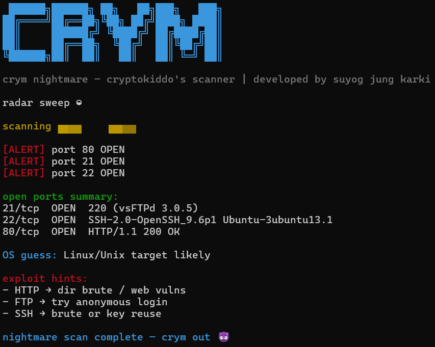

# crym — Nightmare Edition

### cryptokiddo’s offensive network scanner

> Lightweight, high‑performance network scanner for offensive security learning
> Developed by **Suyog Jung Karki**

---

## Overview

**crym** is a fast, multi‑threaded network scanner written in Python, built for **Port Scanning & Host-Discovery**.

The **Nightmare Edition** focuses on speed, clarity, and terminal aesthetics while remaining lightweight and dependency‑free. The tool is designed to feel professional and readable, without unnecessary noise.


---

## Key Capabilities

* Multi‑threaded TCP port scanning
* Service and version fingerprinting
* Banner grabbing
* Network discovery (CIDR scanning)
* Targeted port range scans
* Clean, readable CLI output inspired by professional tooling
* Animated terminal banner and scan feedback
* Cross‑platform support (Linux, macOS, Windows / WSL)

---

## Screenshot / Demo

The following screenshot demonstrates a typical scan workflow, including open port detection, service fingerprinting, OS guessing, and exploitation hints.




---

## Requirements

* Python **3.8+**
* Standard Python libraries only

No external dependencies are required.

Verify Python installation:

```bash
python3 --version
```

---

## Installation

### Linux 

```bash
git clone https://github.com/eezy18x/crym.git
cd crym
sudo chmod +x crym
sudo mv crym /usr/local/bin/
```

Run:

```bash
crym <target>
```

---

### macOS

```bash
git clone https://github.com/eezy18x/crym.git
cd crym
chmod +x crym
sudo mv crym /usr/local/bin/
```

If blocked by Gatekeeper:

```bash
xattr -d com.apple.quarantine crym
```

---

### Windows (without WSL)

```bash
git clone https://github.com/eezy18x/crym.git
cd crym
python crym <target>
```

---

### Windows (WSL recommended)

Install WSL with Ubuntu, then follow the Linux installation steps above.

---

## Usage

Basic scan:

```bash
crym <target>
```

Service and banner scan:

```bash
crym <target> -m service
```

Network discovery:

```bash
crym <network>/<cidr> -m discover
```

Custom port range:

```bash
crym <target> -p <start-end>
```

---

## Project Philosophy

* Minimal dependencies
* Clear output over noisy verbosity
* Built to understand how scanners work internally
* Designed to resemble real‑world offensive security tooling

---

## Legal Disclaimer

This tool is intended for **educational use and authorized security testing only**.
The developer assumes no responsibility for misuse or damage caused by this software.

---

## License

MIT License

---


